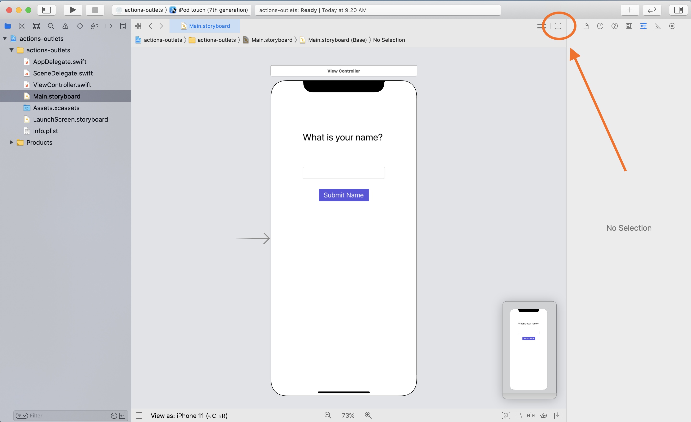
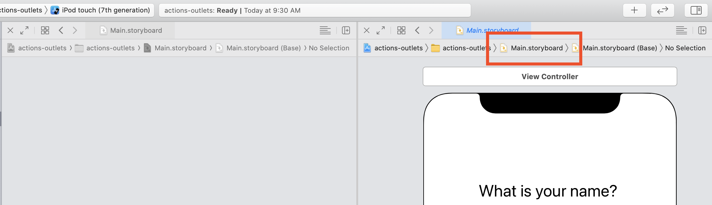
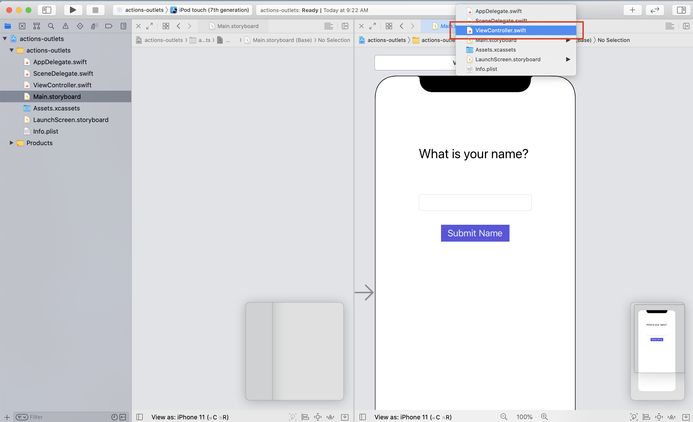
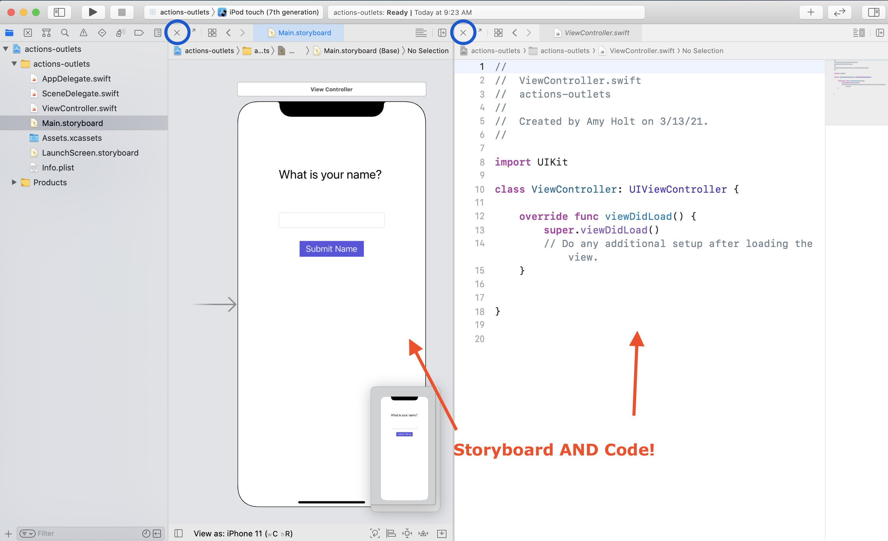

[Back to all Lessons]({{ site.url }}/swift-ios/lessons)

## 🎯 Learning Goals

* Explain the purpose of actions and outlets
* Establish actions and outlets in Xcode

## 📗 Technical Vocabulary

- actions
- outlets
- Assistant Editor
- unwrap

## 🌎 Actions & Outlets

Actions and Outlets are the way that our program lets the design files communicate with the code files. The connection allows us to refer to the objects in the _design_ file from inside of our _code_ file.
* **Outlet** - when you want to change the appearance of something or keep track of information
* **Action** - when you want the code to know that a user took an action

## Setting up your work area

Before we get started, we need a `Label`, `Text Field`, and `Button` from the Object Library. The focus of this is not design, so don't worry about applying constraints. The goal of this app is that when the user types something in the text field and clicks the button, the text they typed becomes the title in the label!

Before you can start creating connections, your work space needs to be set up correctly. Click on the small icon in the top right corner of the Editor pane that include a plus sign to open the Assistant Editor, pictured below:



When you are in the Assistant Editor, you should see two panes in the Interface Builder - it _usually_ defaults to displaying the StoryBoard showing in both panes. Click the "file path" in one pane to open up a menu of all available files:



Then select the file you'd like to display (usually the ViewController.swift):



After you've selected the desired file for each pane, you should see a StoryBoard in one pane and the code file in the other. If you ever want to go back to only viewing one or the other, there is a small "X" icon in the top left corner of each pane that you can click to exit that pane (circled in blue):


<br>

## Outlets

<div class="try-it">
  <h2>🗂 Brainstorm</h2>
  <p>Considering the goal of this small application, what information do we want to keep track of?</p>
  <p>What objects will we want to change the appearance of?</p>
</div>

Ultimately, we want to know what the user typed in, because anytime we type something into a form, that data has to go somewhere. Maybe that data logs us into an account, maybe it orders dinner, etc.

The goal of this really cool app is to have the user type something in the box, click submit, then they should see whatever they typed in appear as the app title. So, we want to keep track of what they typed in, and we will want to change the appearance of the `Label`.

### Establishing First Outlet

Press down the `control` button as you click the text field, then drag your mouse to the code, right in the first or second line of the class. A blue arrow should show what you are doing. When the little box pops up, you will need to type in a name - this will be a variable name that represents this data. You want to use something that describes the data.


When we created the outlet, Xcode generated some swift code for us, which lives in the `ViewController.swift` file. Let's break it down:

```swift
@IBOutlet weak var question: UILabel!
```

`@IBOutlet` means an outlet on the Interface Builder has been created. `weak` - we'll ignore. `var question` is a declaration of a new variable called question, and `var question: UILabel!` means the variable doesn't have a value assigned, but holds the data type of a `UILabel`.

> This code was generated when we established the connection, and we should **not** make any changes to it. If you need to edit the spelling or change the variable name, watch <a target="blank" href="{{ site.url }}/swift-ios/lessons/videos/change-actions-outlets">this video</a>.

We created this first outlet so that we can control the text in this `question` label. This means we can change it once we have whatever text the user typed in.

### Establishing Second Outlet

We are creating this second outlet to keep track of what the user types in. We will only do something with it once the user clicks "Submit Name"; however we have to set up the outlet from the get-go. That's why we drag outlets to the top of the class.


<br>

## Actions

<div class="try-it">
  <h2>🗂 Brainstorm</h2>
  <p>What <strong>actions</strong> can our user take in this application?</p>
</div>

The main action a user will take is clicking submit. You may think that typing in the text field is an action; it is. However, we don't want to create an `action` for that user interaction because we want to wait until the user decides to tap submit until we do anything.

### Establishing an Action

Press down the `control` button as you click the submit button, then drag your mouse to the code, below the already written functions. A blue arrow should show what you are doing. When the little box appears, make sure to select "ACTION" in the Connection drop down if it doesn't default to that. Then give it a name - this is a function so should follow naming conventions for functions. Under "Type" change "Any" to "UIButton."


When we created the action, Xcode generated some swift code for us, which lives in the `ViewController.swift` file. Let's break it down:

```swift
@IBAction func submitButtonTapped(_ sender: UIButton) {
}
```

`@IBAction` signifies that this is connected to an action that will take place on the StoryBoard. `func` declares a new function. `func submitButtonTapped` names the function `submitButtonTapped`, and the argument `(_ sender: UIButton)` means that the button will send the message that this function needs to run (_we_ will never call it in our code). Then, a code block opens, where we need to provide with some directions.

### Writing Code in the Action Function

Now that we have a function which will run once the user clicks the button, we need to give our function some directions. Check out the code below:

```swift
@IBAction func submitButtonTapped(_ sender: UIButton) {
    if let newTitle = textField.text {
        question.text = newTitle
    }
}
```

Let's break down what is happening here. First, we have to **unwrap** the `textField.text` to make sure it is not nil. We assign the `textField.text` value to a new constant called `newTitle`.
If we make it into that code block (if textField.text is not nil), then the `question.text` is assigned to the `newTitle`.

Get your code up-to-date with this, and run in simulator. It should be working! If it's not, ask a neighbor or instructor.

<div class="try-it">
  <h2>🐣 Discuss</h2>
  <p>In total, we had three actions/outlets. With your breakout group, discuss each one in detail - how did you establish it and what is its job? Would your app work without it? Why or why not?</p>
</div>

## iOS: Actions & Outlets

Whether you followed along in class or watched your instructor model, this is a piece of iOS development that you really want to have down. Complete the activity below so you feel 100% confident in establishing actions and outlets for your applications.

<div class="practice">
  <h2>Practice: Actions & Outlets</h2>
  <p>Build an app that takes at least 2 user inputs, has some sort of 'Submit' button, provides a custom alert to the user when the button is tapped.</p>

  <div class="challenge-container spicy-heat">
    <p class="spicy-click">Click here for a Spicy Challenge 🌶🌶🌶</p>
    <div class="spicy-toggle">        
      <p>Use the Date Object from the Object Library so your user can select a time. Figure out how to format the string that is provided to write the time in a more readable format such as "8:30 am."</p>
    </div>
  </div>

</div>

<br>
[Back to all Lessons]({{ site.url }}/swift-ios/lessons)
