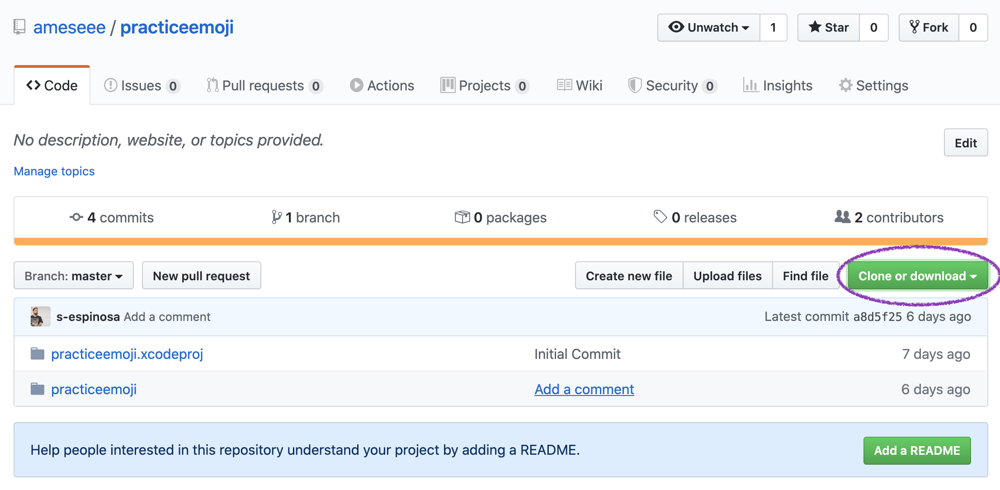
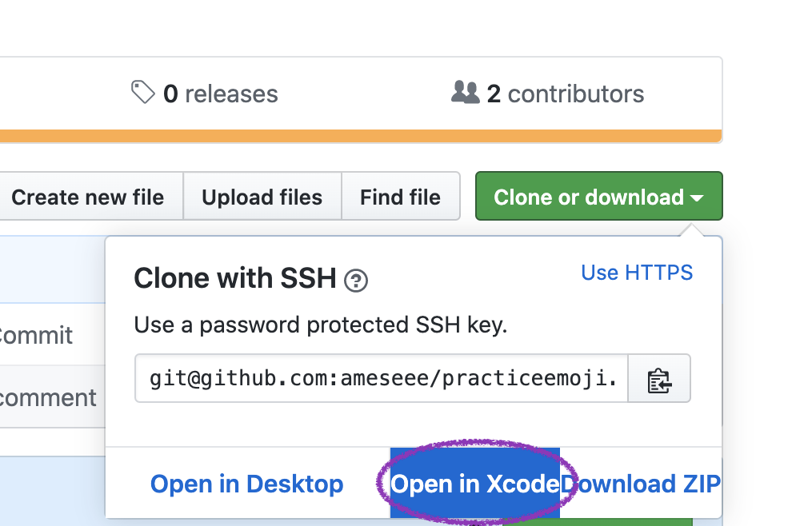
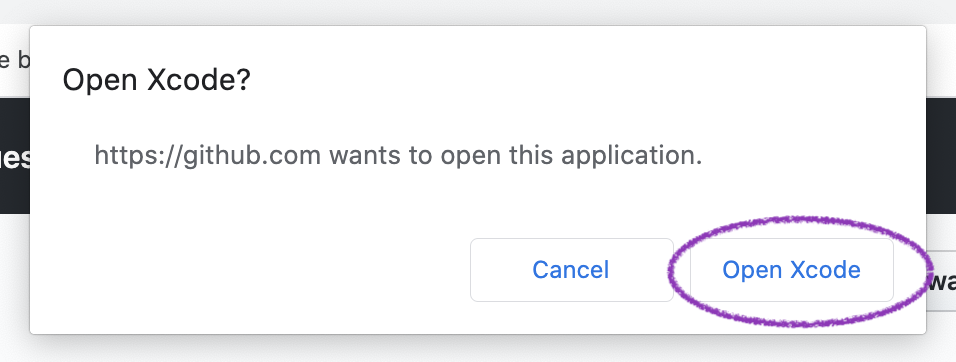
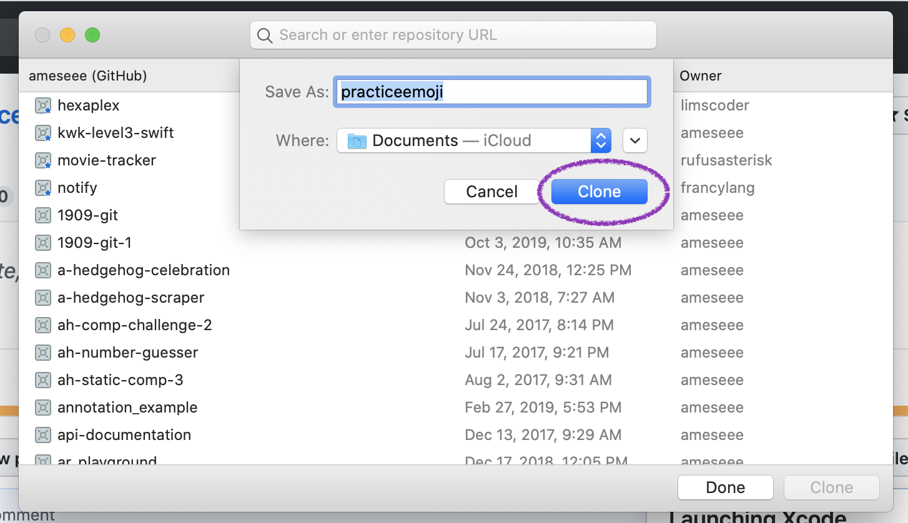
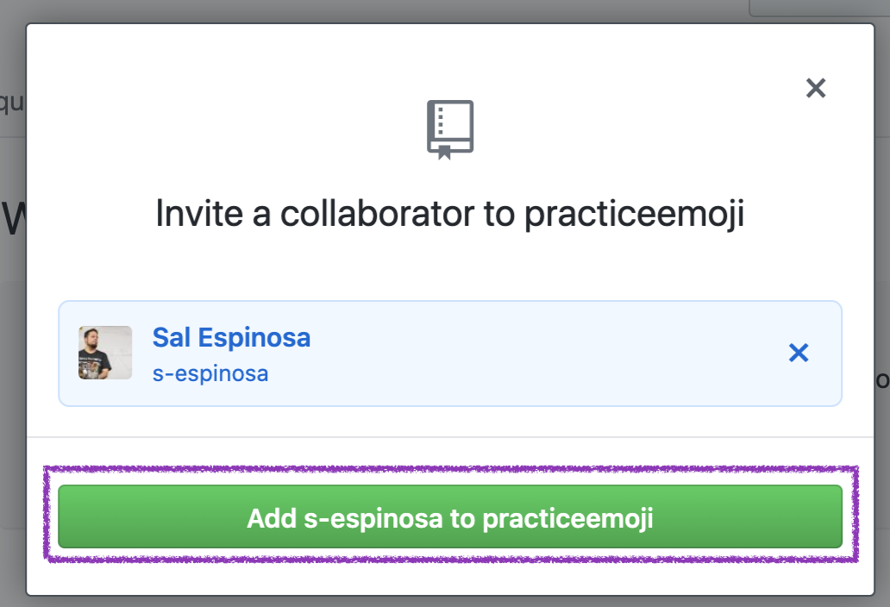
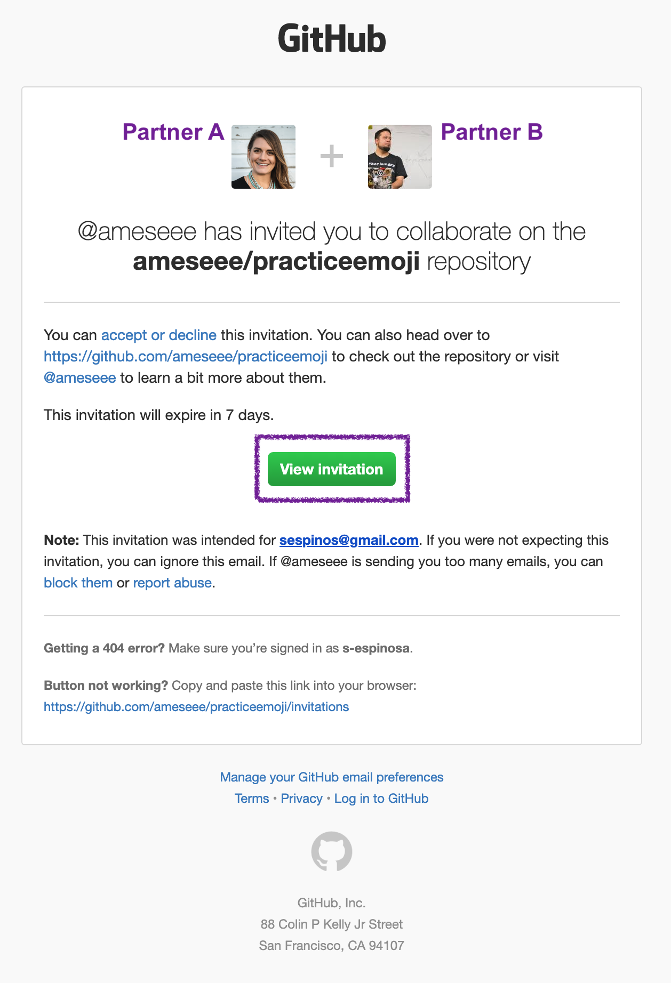
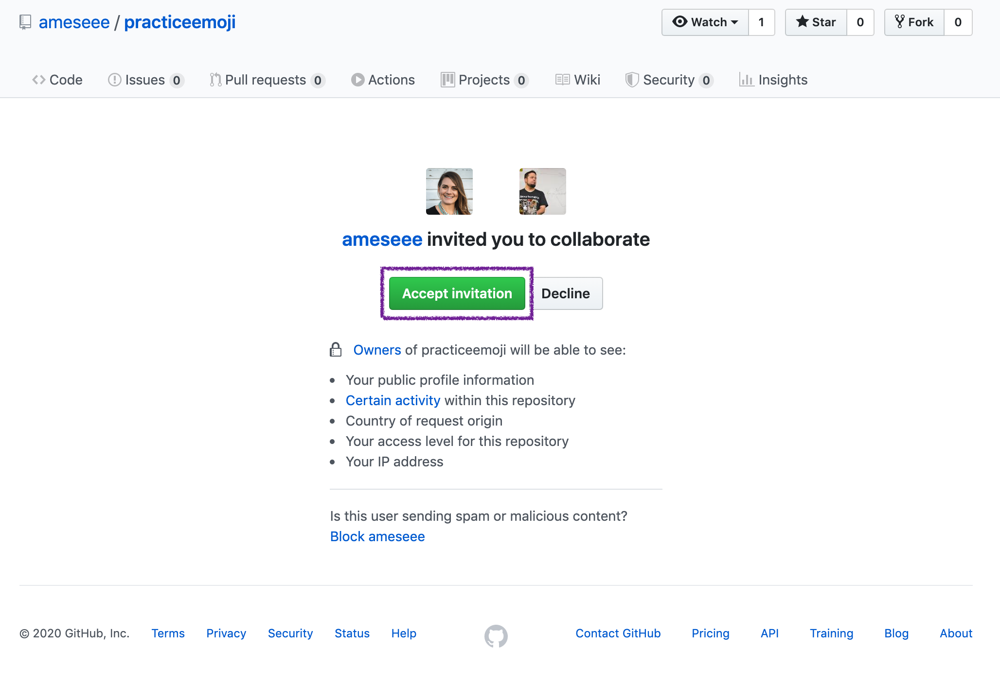
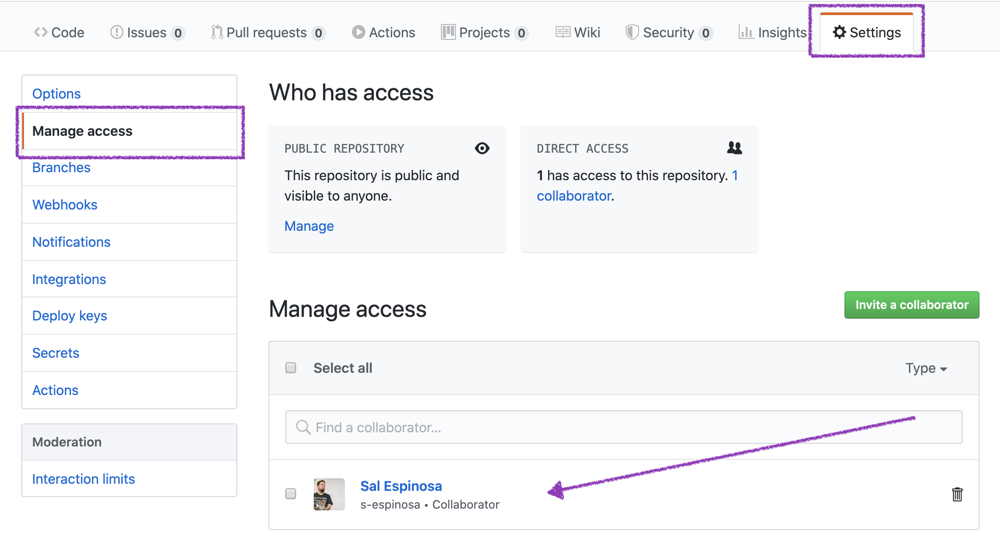

[Back to all Lessons]({{ site.url }}/swift-ios/lessons)

## Purpose

You will likely collaborate with another scholar on your final project. This document will outline how to get set up to work on the same project, and give you guidelines for what your workflow should look like once you're set up.

Each step listed below will pertain to one partner or the other. The emojis are used in the step titles to make it as clear as possible.

### 💖 🔮 Step 0: Connect Xcode to GitHub

Both partners must complete steps 1-2 of the [Git & GitHub walk-thru]({{ site.url }}/swift-ios/lessons/git-github) before continuing. It is likely that you've already done this!

### 💖 Step 1: Create Project

Partner A should follow steps 3-7 in the [Git & GitHub walk-thru]({{ site.url }}/swift-ios/lessons/git-github). For step 5, they don't need to build the entire project; just take the first step in building the project.

Send the URL of the GitHub repository to Partner B in Slack.

### 🔮 Step 2: Open the Project in Xcode

Partner B should open the GitHub link they got in Slack.

Click the green "Clone or download" button on the right side of the page.

Now, click "Open in Xcode".

An alert will pop up, asking if you'd like to open in Xcode. Click "Open".

Xcode will automatically open, with a window that looks like this. Click "clone".

Now, the Xcode project will open. Don't start working on the project until Partner A completes the next step!

### 💖 Step 3: Invite Partner B to Collaborate

Partner A should go into to project on GitHub. Click "Settings" from the menu bar. Select "Manage Access" from the list of options on the far left. Click the green "Invite" button.

Type in Partner B's GitHub username. Select their name, then click "Add <partner-username> to <project name>".

You'll know you've done this successfully if you now see your partners name and "awaiting response" and "pending":

### 🔮 Step 4: Accept Invitation Collaborate

Check your email. You should have an email from GitHub and the contents of it should look like the image below. Click "Accept Invitation".

You'll be taken to the GitHub project page in your browser. Click "Accept Invitation".

### 💖 Step 5: Confirm Partner B is a Collaborator

To confirm that Partner B is set up to collaborate, go back to Settings, Manage Access, and you should see that your partner is no longer pending, but a collaborator now!

### You're All Set Up!

Both Partners A and B can contribute to this project. Because both partners are able to make changes, this opens the doors for potential challenges. Read the next section and follow the procedures very carefully to avoid those challenges.

## Workflow

When you are collaborating on an Xcode project this summer, it's very important to follow the workflow listed below. This will ensure you don't lose any work and that both partners have code that is up-to-date.

### One Xcode at a Time

Only one partner should be working in the Xcode project at a time. Most times, you will be screensharing over zoom while working.

### End of Work Session

At the end of each work session, follow these steps, in order:
1. The partner who was working in Xcode on their computer should commit and push to GitHub
2. Go to your GitHub project page and confirm that a commit was just made (either partner can check this!)
3. The partner who was not working in Xcode for this session should now open Xcode, select Source Control, "Pull...", then click "Pull". Run the project and you should see the updates that were made on your partners computer.

### Before each Work Session

To make 100% we are up-to-date, both partners should go into the Xcode project, select Source Control, "Pull...", then click "Pull". If you did the "End of Work Session" tasks in your previous session, you should see a box that tells you "This repository is up to date." - that's good! Now you are ready to being coding. Remember, only one partner should be working in the Xcode project at a time.

 
[Back to all Lessons]({{ site.url }}/swift-ios/lessons)
