[Back to all Lessons]({{ site.url }}/swift-ios/lessons)

## Purpose

As many scholars are interested in pursuing STEAM after High School, we want you to have the opportunity to showcase the work you've done here at Kode With Klossy. This tutorial will walk you through how to save your code on a site called GitHub. GitHub is one of the most popular sites for developers to host their projects.

Before you start this tutorial, you will need to have an Xcode Project opened. You can use an already created project you want to save to GitHub or make you can make a new one just to practice.

## Step 1: Create a GitHub Account

_You will only have to complete Step 1 one time._

Go to [GitHub](https://github.com/) and create an account if you don't already have one. As you create a username, keep in mind that you may want to use this for a resume, so keep it professional!

Make sure to remember what password you create; you will need it in the next step.

## Step 2: Connect GitHub to Xcode

_You will only have to complete Step 2 one time if you work on the same computer for all of camp._

In Xcode, select "Xcode," then from the drop-down that appears, select "Preferences."

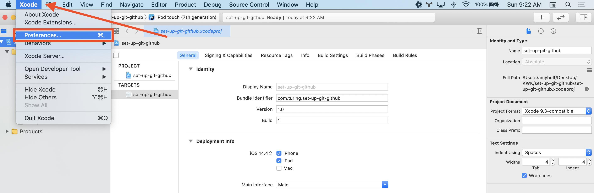

Within the Preferences box, select the "Accounts" tab.

Next, click the small "+" button in the bottom-left corner of the Preferences box. A drop-down will prompt you to select the type of account you would like to add. Choose "GitHub," then click "Continue."

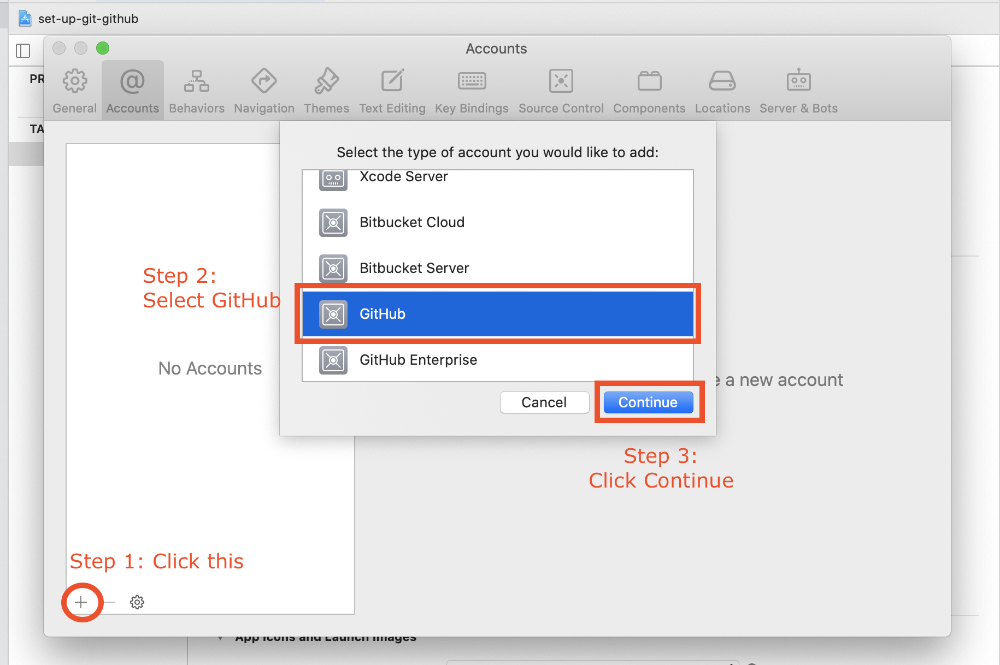

Now, enter YOUR GitHub username in the first text input box that appears. Click the blue link and follow the instructions to create an access token. Once you create the access token, copy and paste it into the second text input box.
  - _In step 7 of the instructions, make sure to select all the scopes as not doing so can cause errors on Xcode later on._

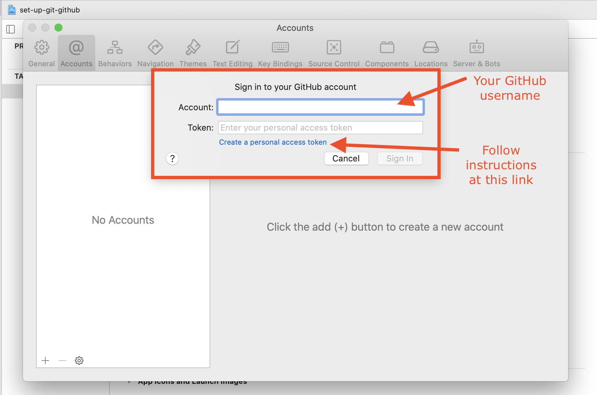

Confirm that you are signed in by clicking "GitHub" inside the Preferences box. You should see your username in the middle of that box.

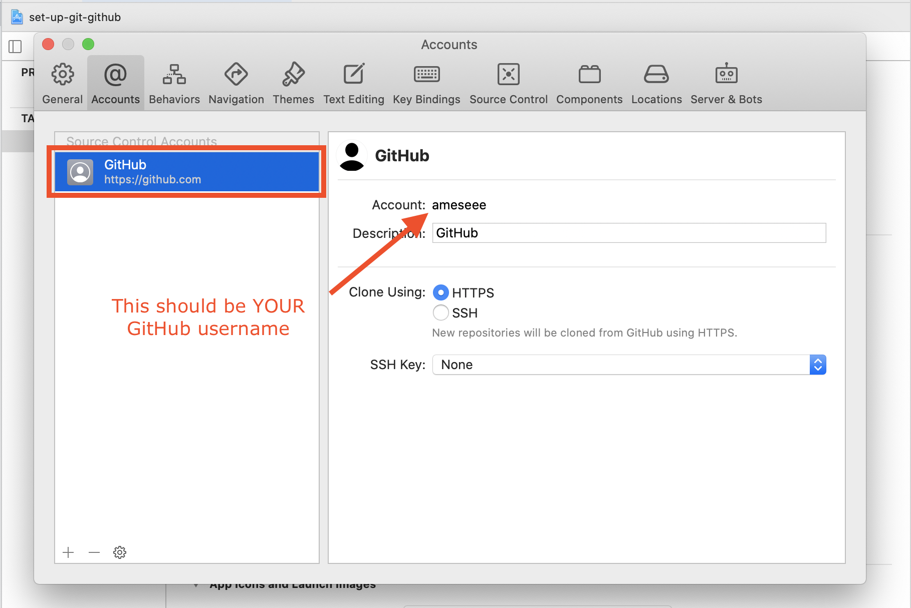

## Step 3: Create a Git Repository

_You only need to do this once for every project you want to save on GitHub._

A Git Repository is a project that is being managed by Git. Git is a version control system. If you've ever used Google Docs and noticed that you could see what changes have been made, and when they were made - that's similar to what this is, but for code!

While you are in an Xcode Project, select the "Source Control" drop-down, then select "Create Git Repositories."
  - _If you get a message saying "All projects are already under source control" at this step, move to Step 4._

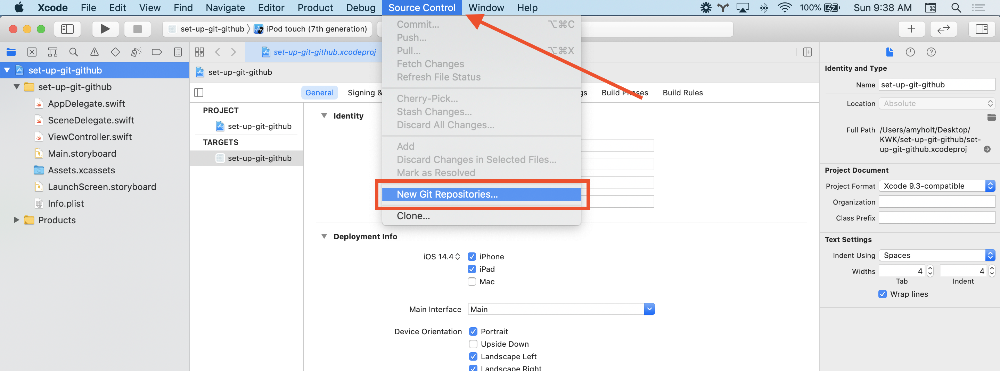

Now, make sure the project is selected and click "Create." (In the screenshot below, the file path was really long so the checkbox is partly cut off from view, but make sure to select the tiny checkbox to the left of the project!)

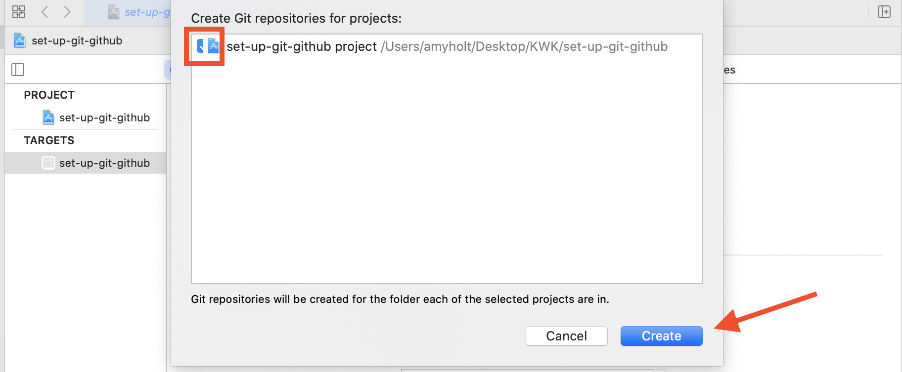

## Step 4: Connect this Project to GitHub

_You only need to do this one time for every project you want to save on GitHub._

The Git Repository alone isn't enough to keep your code safe - it's only saved on the machine you are currently working on. That's where GitHub comes in - it's a web application that can keep track of all your Git Repositories. If you want to work on a project from a different computer, GitHub makes this possible!

In the same Xcode project, select the Source Control Navigator in the Navigation Pane. Click the small arrow left of your project name to expand the folder. You should see four folders with yellow icons to the left of each one.

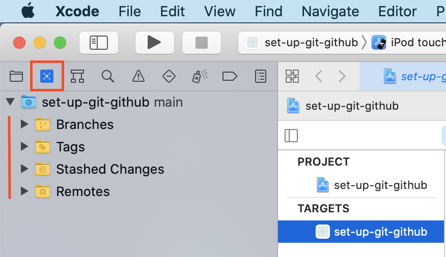

Two-finger click on the folder labeled "Remotes". You will see a drop-down appear. From this, select "New 'your-project-name' Remote..." Another box will appear. You shouldn't need to change anything; click "Create."

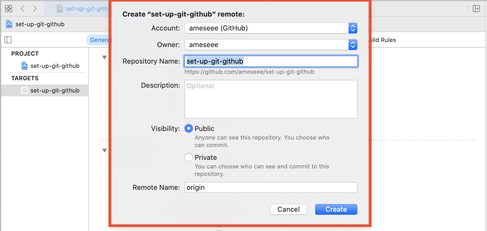

## Step 5: Build your Project!

Before you can go on with Git and GitHub, you'll have to build a StoryBoard or write some code. If you are working through these steps to practice, the smallest change will work!

## Step 6: Commit Changes

_You only have to do this once, but can do as many times as you want for each project._

Committing your changes is like sealing an envelope up before you put it in the mailbox. You may want to send your code to GitHub chunk by chunk - maybe at the end of each iteration of a project. Or, you might just want to send it all at once, when you are finished.

To commit your changes, select "Source Control" then "Commit."

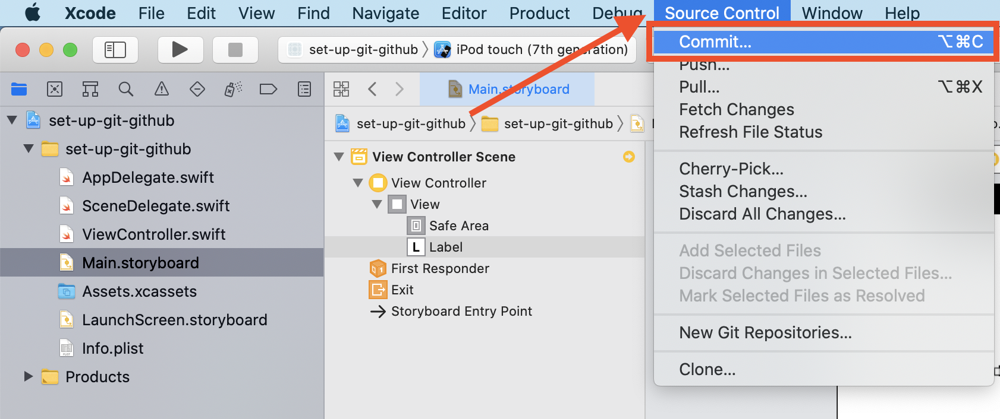

A big window will slide down over almost all of your Xcode screen. You may see some very unfamiliar code - that's ok! That's probably code that was automatically generated from you drag-and-dropping onto the StoryBoard.

Make sure that all files available are checked in the top left corner. Then, write a short message explaining what your changes were in the bottom text area. Finally, click "Commit X file."

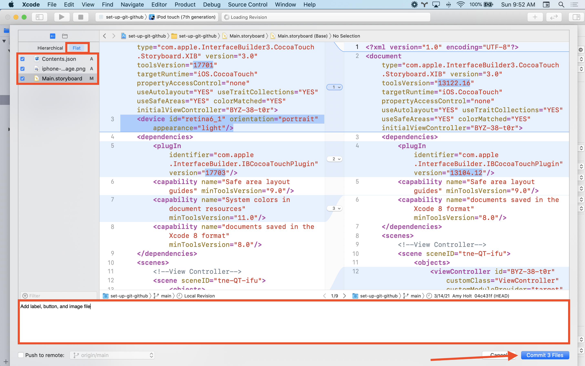

After committing your changes, you can continue working, then commit again later. Or, you can move to Step 7 and send your code to GitHub.

## Step 7: Push Repository to GitHub

The final step in the process is to "push" or send your code up to GitHub. This ensures it's in a safe place - if you lost your computer, for example, the code would still be on GitHub!

Select "Source Control," then "Push."

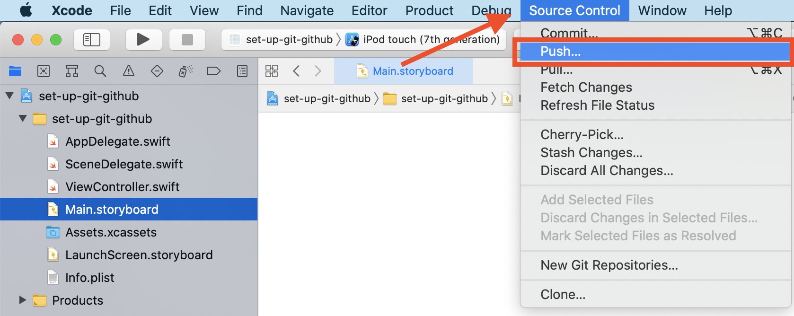

When the "Push local changes to:" box appears, click "Push."

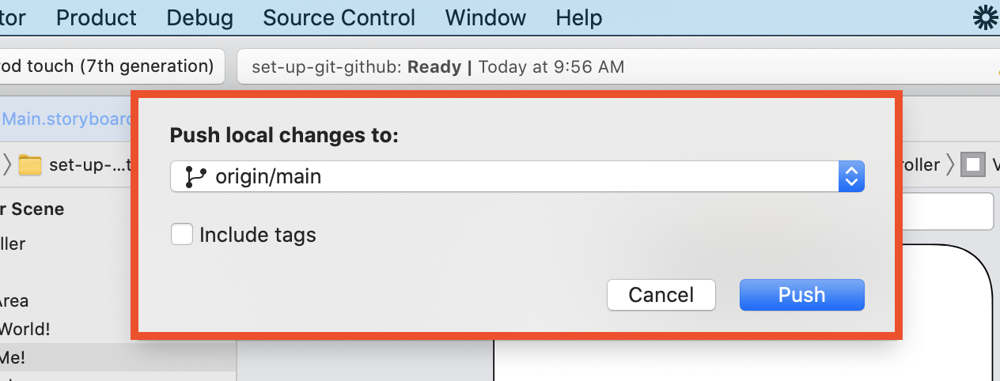

## Check your code on GitHub

Go back to your GitHub account and select "Repositories." The first item that should show up is the project you were just working on in Xcode. The example used in this tutorial was called `setting-up-git-github`, so it appears here:

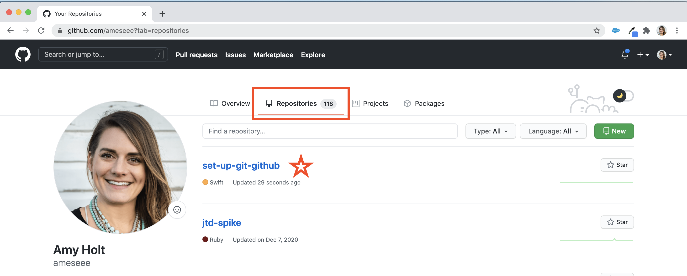

Click the title of your project. You will be taken to a page that looks like this:

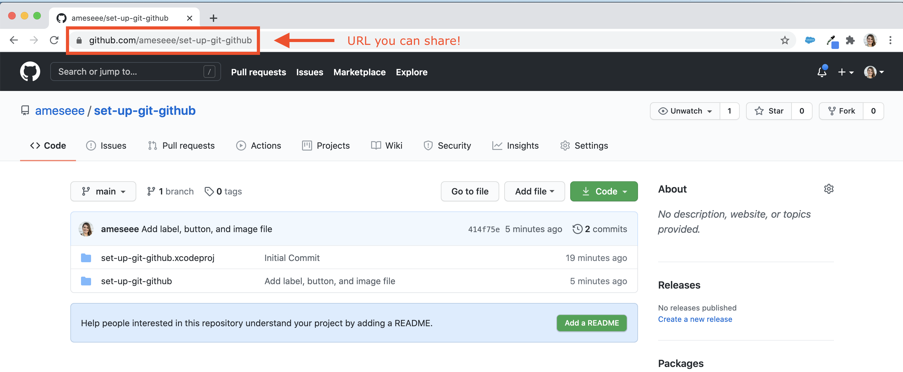

It looks really different from Xcode, but rest assured, the code is still there. If you want to link any of your projects to your resume, use the URL for this page!

 
[Back to all Lessons]({{ site.url }}/swift-ios/lessons)
