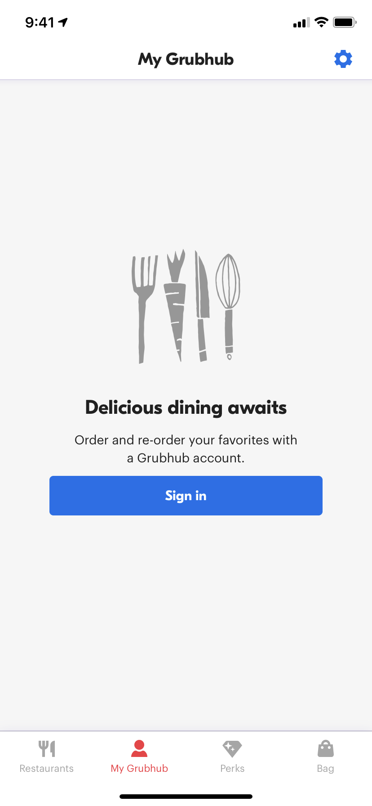
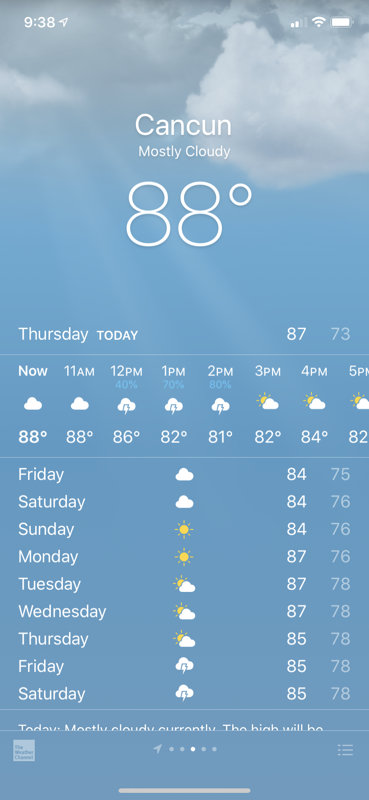

[Back to Practice Index]({{ site.url }}/swift-ios/practice)

## Build a StoryBoard

Choose one of the four screenshots from real iOS apps below to re-create. You may not have time to recreate every little detail; that's ok! Start with the biggest pieces first, then work your way in. Choose any icons/photos you'd like!

 
[Back to Practice Index]({{ site.url }}/swift-ios/practice)
