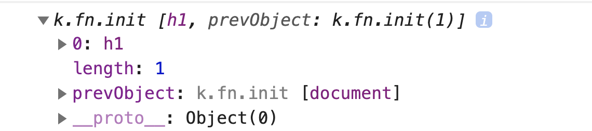
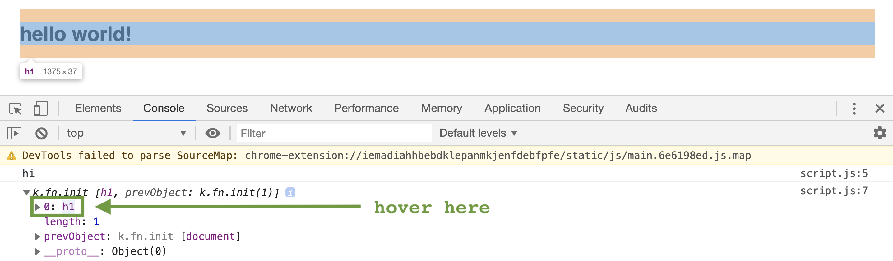

## Learning Goals

* Use the console in the Chrome Developer Tools
* Query and update a page after its been loaded
* Respond to user interactions with event listeners

## Technical Vocabulary

- CSS Selector
- DOM (Document Object Model)
- Event
- Event Handler
- Event Listener
- HTML Element
- jQuery
- library

## Warm Up

In order to work all the way through this lesson, we will need to learn how to use the Chrome Developer Tools (aka Dev Tools). We've used the console in repl quite a bit up until now; the Chrome Dev Tools are a more sophisticated version of that!

Like a true developer, you are going to take some time to do some research to teach yourself how to use this tool. Below are three resources, but feel free to find your own great resources as well!

- [This short screencast was made just for you!](https://screencast-o-matic.com/watch/cYeoYgxaxn)
- [Here is a tutorial on how to open the Dev Tools](https://support.airtable.com/hc/en-us/articles/232313848-How-to-open-the-developer-console#chrome)
- [Here is a video on how to use a console.log](https://www.youtube.com/watch?v=z5g78hPmQM4)
- [Here is a blog post on how to use console.log](https://medium.com/@marycriv/using-console-log-and-debugger-in-chrome-devtools-b1d5aca41fa8) (You can stop reading when you get to the `debugger` section)

## What is the DOM?

The **DOM**, or Document Object Model, represents how the browser reads HTML. It allows JavaScript to interact with your HTML, which ultimately lets us manipulate, structure, and style our websites.

**Manipulating the DOM** refers to changes that are made in the browser, which are prompted but not directly created by the user.

Here's a real-life example of DOM Manipulation:
> If I type my email in a form, then click "Submit," I might see a message like "Thanks for signing up!"

I clicked the button, and in response, JavaScript made that message appear. In this lesson, we will learn how to change something on our site based on user interaction.

<div class="try-it">
  <h2>Brainstorm</h2>
  <p>Visit your favorite site. Write a list of at least 3 places you think the developers used DOM manipulation. Be ready to share!</p>
</div>

## jQuery

There is a popular **library**, or chunk of code someone else wrote, called **jQuery**. There are a lot of things it can do, all of which are still JavaScript, but it's less for us to write!

During camp, we will use jQuery anytime we want to write code that interacts with elements on the DOM. Keep in mind that when we use features of jQuery, we are still writing JavaScript. It's just a little "extra" on top!

## Access Elements from the DOM

Accessing elements is the first step in building out the functionality to respond to user input. By the end of this lesson, you'll be able to let a user click a button, and see something happen on the screen in response to the click. We have a lot to learn in the meantime, but we'll take it step by step.

jQuery has some `built-in` functions that allow us to access elements from the DOM. Here's an example of accessing an `h1` element.

```html
<h1>Hello, World!</h1>
```
```js
var header = $('h1');
console.log(header);
//=> "k.fn.init(0)"
```

Let's break this down:
- `$` - This dollar sign is packed with functionality! It gives the instructions: go to the HTML document, and find a specific element.
- `('h1')` - this is the argument passed to the `$` function. It says: go look in the HTML document for all the `h1` elements that you find.
- Since we stored the value of this in the `header` variable, we can `console.log()` this and see the HTML element.

The output of `k.fn.init(0)` may look strange and not helpful. If you click the small arrow to the left of it, you should see something like this:



This still may feel strange, but let's dig into it. Notice that one the second line, we now see `0: h1`. This is saying that the first (and only) element that was found and stored to this variable was an `h1` element.

If you hover over that line that says `0: h1`, you will see the element in the browser become highlighted.



To make this feel a little more helpful, we can ask for the text inside of the `h1` element, with this syntax:

```html
<h1>Hello, World!</h1>
```
```js
var header = $('h1');
console.log(header.text());
//=> Hello, World!
```

### Accessing Elements with Class Names

We can also access elements by classes. Instead of `('h1')` we would need to write something like `('.class-name')`, using the same selectors we would when writing CSS rules for classes.

<div class="try-it">
  <h2>Try It: Accessing Elements</h2>
  <p>Use <a target="blank" href="https://glitch.com/~intro-to-dom-try-it">this Glitch project</a> as a starter. We will use this project throughout today's lesson.</p>
  <p>First, familiarize yourself with the existing HTML elements. For this activity, you should not need to change the HTML.</p>
  <p>In your JavaScript file, write code to access each element and store in a variable, then print to the console. Practice accessing elements by element type or class. In the console, you should see your <code class="try-it-code">console.log</code> statements.</p>

  <div class="challenge-container medium-heat">
    <p class="spicy-click">Click here for a Medium Challenge 🌶🌶</p>
    <div class="spicy-toggle">
      <p>Create a duplicate of the <code class="medium-code">h1</code> element in the HTML and check the console. Was anything different printed this time? Why? What does this tell you about the importance of using classes?</p>
    </div>
  </div>

</div>

## Change Content on the DOM

Now that we can access elements and store them in a variable, the possibilities are endless! Let's start by programmatically changing the content of an element. We can use `.text()` to **change** the text inside of an element.

```html
<h1>hello</h1>
```
```js
var header = $('h1');
header.text("HIIII");
//=> In the browser, the hi now says HIIII
```

What's happening? The `h1` element has a method called `text`. When we originally wrote the `h1`, we gave it a `text` value of "hello" by typing "hello" between the tags. jQuery  provides us with a method to change that original text. Whatever string is passed into, or typed into the parenthesis after `.text`, will replace the text inside of the `h1`.

<div class="try-it">
  <h2>Try It: Change Text</h2>
  <p>Continue working in the Glitch project from the last Try It.</p>
  <p>By only adding code to the JavaScript file, change the text inside of at least two elements.</p>

  <div class="challenge-container medium-heat">
    <p class="spicy-click">Click here for a Medium Challenge 🌶🌶</p>
    <div class="spicy-toggle">
      <p>If you changed the text of the <code class="medium-code">h1</code> on one line of code, then on the line below changed it to something else, which one would show in the browser? Why?</p>
    </div>
  </div>

</div>

This was interesting, but we could have just written different text inside the HTML tags to accomplish what we just did here. As was mentioned earlier, we are taking today's concept step by step. Move on to the next section and you'll start seeing some ✨magic✨ happen!

## Events

Events are really at the core of DOM Manipulation. When we talked about user interaction earlier, that's exactly what we mean. An **event** is any action that the user takes while on our site. Clicking a button, scrolling down, hovering over something, and more.

### Event Listener

Imagine that you’ve just ordered food fror delivery and are waiting for it to arrive. When the doorbell rings, you’ll stand up from the couch, walk over to the door, open it, and take your food. Guess what? You programmed yourself with an event listener.

In order for our site to respond to events, we need to write some code so that our site becomes "smart" enough to look out for a specific event on a specific element. This "look out" is called an **event listener**. Their job is to sit around and wait for an event to take place in the browser, and call a function for us when it does.

The Glitch project below has an example of the syntax. Click View Source to look at the JavaScript. Back in View App: Click the button. Click the button a second time. What happens _each time_ you click the button?

<div class="glitch-embed-wrap" style="height: 420px; width: 100%;">
  <iframe
    src="https://glitch.com/embed/#!/embed/example-event-listener?path=index.html&previewSize=100&attributionHidden=true"
    title="example-event-listener on Glitch"
    style="height: 100%; width: 100%; border: 0;">
  </iframe>
</div>
<br>

<div class="try-it">
  <h2>Turn & Talk</h2>
  <p>With your breakout group, read through each line of the JavaScript file in the Glitch project above. Lines 4 and 9 should be somewhat familiar; but line 6 is brand-new. What is your prediction about what each part of the code is doing?</p>

  <div class="challenge-container medium-heat">
    <p class="spicy-click">Click here for a Medium Challenge 🌶🌶</p>
    <div class="spicy-toggle">
      <p>The function <code class="medium-code">doSomething</code> is never called with the syntax we've learned: <code class="medium-code">doSomething()</code>. Why not? What happens if we add <code class="medium-code">()</code> after <code class="medium-code">doSomething</code> on line 3? Remix the project to find out!</p>
    </div>
  </div>

</div>

Takeaways:
- `Line 4` declares a variable that stores the `button` element
- `Line 6` creates an event listener. Our program will now be "on the lookout" for a click that takes place on the button. It won't listen for clicks anywhere else. It won't listen to any other events on that button. Just a click and only on that button. When that button is clicked, it will call the function `doSomething`.
- `Line 8` declares the function `doSomething`. It's just a set of directions, waiting around to do its job. It will be called when the button is clicked.

### Event Handlers

The event listener is responsible for monitoring an element for an event and doing something when the event occurs. The **event handler** is the function that's called when the event occurs. In our previous example, the function `doSomething` was our event handler. These terms are commonly used interchangeably.

<div class="try-it">
  <h2>Try It: Event Listeners & Handlers</h2>
  <p>Go back to the Glitch project about Baby Seals.</p>
  <p>Add a <code class="try-it-code">button</code> element in the HTML.</p>
  <p>Now, update the JavaScript so that when the button is clicked, the text in the <code class="try-it-code">h1</code> changes to something that it wasn't originally.</p>
  <p>When you're done, answer these questions with your partner:</p>
  <ul>
    <li>What line of code is your event listener on?</li>
    <li>What type of event is your listener on the lookout for?</li>
    <li>What is the name of your event handler?</li>
  </ul>
</div>

## Access CSS

One cool thing about JavaScript is that since it's accessing your HTML elements, you can also access the styles that have been applied to each element. It works kind of like `text()`; there's a property on the element that we can change. We can add, remove, replace, or toggle CSS classes!

Check this out:

<div class="glitch-embed-wrap" style="height: 420px; width: 100%;">
  <iframe
    src="https://glitch.com/embed/#!/embed/example-toggle-ss?path=script.js&previewSize=100&attributionHidden=true"
    title="example-toggle-ss on Glitch"
    style="height: 100%; width: 100%; border: 0;">
  </iframe>
</div>
<br>

<div class="try-it">
  <h2>Turn & Talk</h2>
  <p>Remix the Glitch project above, then answer these questions with your breakout group:</p>
  <ul>
    <li>Why does the button go back and forth between pink and purple?</li>
    <li>Try changing <code class="try-it-code">.toggleClass</code> to <code class="try-it-code">.addClass</code> - what happens?</li>
    <li>What happens when you change <code class="try-it-code">.toggleClass</code> to <code class="try-it-code">.removeClass</code>? Why?</li>
    <li>Uncomment line 11 in the JavaScript file then click the button a few times. What happens? Why?</li>
  </ul>
</div>

Takeaways:
- `.addClass` will add a class to an HTML element
- `.removeClass` will remove a class from an HTML element
- `.toggleClass` will check if an HTML has a specific class. If it does, it will remove the class. If it doesn't, it will add that class.

Besides accessing CSS rules by classes, we can also add CSS property/values! Check out the code in the project below:

<div class="glitch-embed-wrap" style="height: 420px; width: 100%;">
  <iframe
    src="https://glitch.com/embed/#!/embed/example-add-css-rule?path=script.js&previewSize=0&attributionHidden=true"
    title="example-add-css-rule on Glitch"
    style="height: 100%; width: 100%; border: 0;">
  </iframe>
</div>
<br>

Let's break this down.
- On lines 4-5, we declare the `changeBackgroundBtn` and `container` variables which are storing the button and `div`, respectively
- On line 7, we declare an event listener for the `changeBackgroundBtn` button
- On line 9, we declare the `changeBackgroundColor` event handler
- Line 10 is where the magic happens:

```javascript
container.css('backgroundColor', 'mediumaquamarine');
```

  * `container` references the `container` variable
  * `.css` says: I'm about to give you directions on adding styles, or CSS rules. `.css` takes two arguments, a property, and a value.
  * `'backgroundColor'` says: here is the property I'd like you to add to this element
  * `'mediumaquamarine'` says: here is the value I'd like you to update this property to. We can give any valid color name, hex code, or rgba value. It must be in a string.

This entire line of code accesses the `div` element and updates that elements styles, so we see the background color change in the browser!

<div class="practice">
  <h2>Practice: DOM Manipulation</h2>
  <p>Ever wonder how sites or apps create the "dark mode" feature? You're about to do just that!</p>
  <p>You can either work off of the Baby Seals Glitch project, or <a target="blank" href="https://glitch.com/~practice-dark-mode">start with this one!</a></p>
  <p>Create two <code class="practice-code">button</code> elements in your HTML, both nested inside of a <code class="practice-code">div</code>. One button should be labeled "light mode" and the other "dark mode". They will both need their own class name.</p>
  <p>Now, write the JavaScript so that when the dark mode button is clicked, the background color of the <code class="practice-code">div</code> changes to a dark color. When the light mode button is clicked, the background color should change to a light color.</p>

  <div class="challenge-container medium-heat">
    <p class="spicy-click">Click here for a Medium Challenge 🌶🌶</p>
    <div class="spicy-toggle">
      <p>When an application uses dark mode, not only the background color changes; so do fonts, colors, etc. Add a few more elements to your HTML. When each button is clicked, those elements should change colors appropriately.</p>
    </div>
  </div>

  <div class="challenge-container spicy-heat">
    <p class="spicy-click">Click here for a Spicy Challenge 🌶🌶🌶</p>
    <div class="spicy-toggle">
      <p>In addition to light and dark mode, add a "party mode" button. When clicked, the user should see a screen that looks like a party! Use a <code class="spicy-code">background image</code> instead of a background color. Have some fun with it!</p>
    </div>
  </div>

</div>
