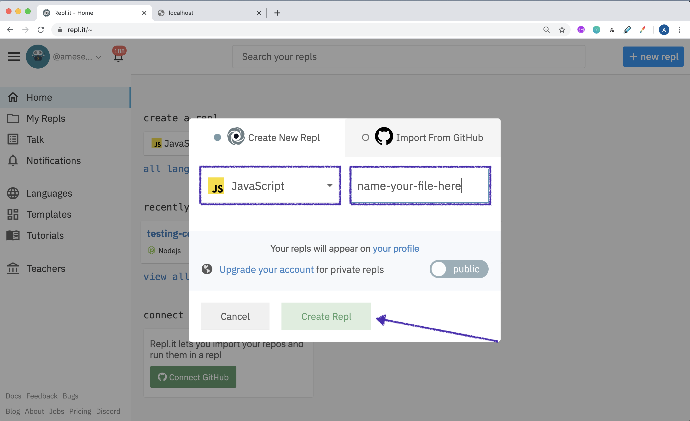
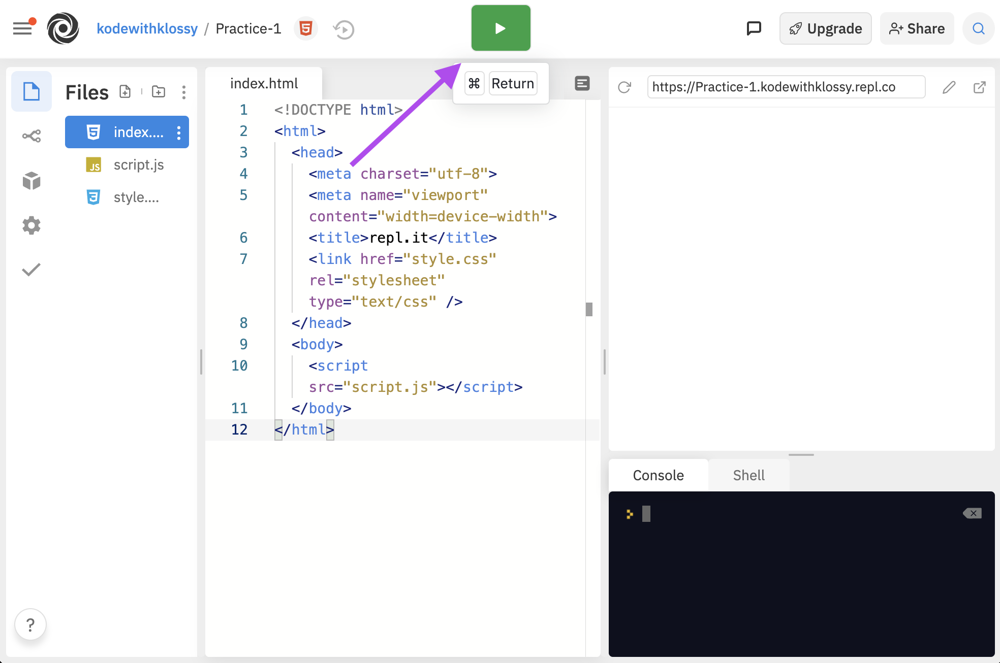

## What is Repl.it?

Repl.it is an online platform where we can write and run our JavaScript code quickly. It's a great place to learn fundamentals and use as a playground! Watch <a href='https://vimeo.com/540389232' target='_blank'>this video</a>, or read each section below to learn a little about how we will use <a href="https://replit.com/~" target="_blank">repl.it</a> at camp this summer.

## Creating a New File

To create a new repl file, click the blue "+" button in the top right corner.

Then, select `HTMS, CSS, JS` as your language. Name your file, then click "Create Repl".

## Run Your Code

Once you write some code and want to run it, click the green "run" button in the top center. You'll see the output on the right side of the page.

## Working off a Starter File

For some practice exercises, your instructors will give you a starter file. It will take a second to load. Then, when you start typing, it will re-load. This is because you don't have access to edit the starter. So, Repl is creating a copy of that file to your account -that's why it re-loads!

## Adding Libraries (like jQuery)

In the left-hand side, you'll see a list of icons.

1. Click the one that looks like a cube (the tooltip when you hover will say "Packages")
1. In the search bar that opens, type "jquery"
1. Click the first result (reads "jquery: JavaScript library for DOM operations")
1. Click the + sign (turns green when you hover over it) to add the library
1. You'll see a new `<script>` tag added to your HTML file!

That's it! Now you can use jQuery in your JavaScript file.

## Sharing A File

To share your code and invite someone to edit or comment on it, click the light blue "share" button in the top right corner.

Then, copy the link that appears towards the bottom of that pop up. Paste the link in Slack. Anyone who clicks on that link will have access to edit that file.

You can share any file you create as well as any file that came from a starter from your instructors.

## Sharing a Webpage

You can also share the webpage of your repl!

In the browser panel, click the "open in a new tab" icon:

You can copy that URL and share it.
